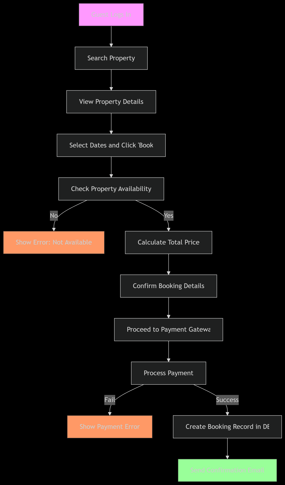

# 🔄 Flowcharts – Airbnb Clone Backend

## 📁 Diagram: Property Booking Workflow

This flowchart visualizes the **end-to-end property booking process** in the Airbnb Clone backend system.

It includes:

- User authentication
- Property search and availability check
- Booking confirmation
- Payment processing
- Booking record creation
- Email confirmation

---

## 🖼️ Preview

---

## ✅ Status

- [x] Diagram created in Draw.io
- [x] Exported as PNG
- [x] Saved in `flowcharts/`
- [x] Committed and pushed to GitHub
